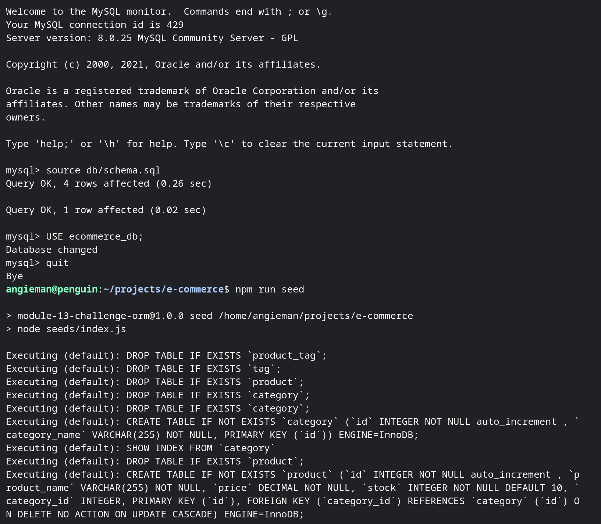
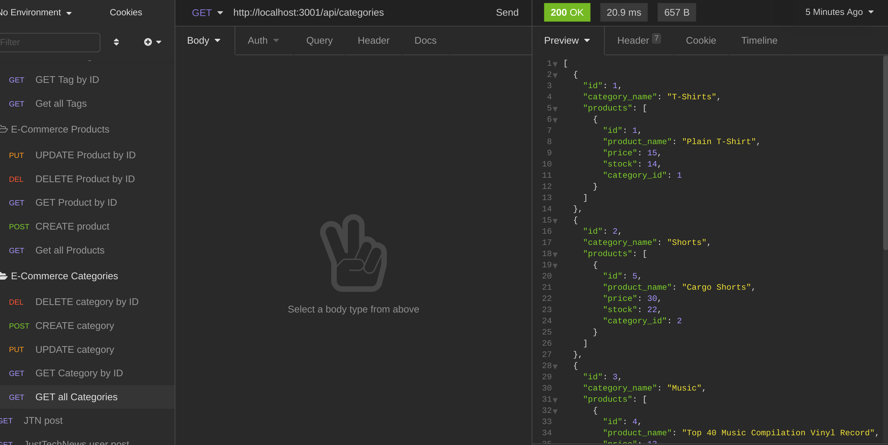

# E-Commerce

## Description
An application that connects the user to an e-commerce database to access product inventory data

User can search by:
* Category
* Product
* Tags

## User Story
As a manager at an internet retail company, I want a back end for my e-commerce website that uses the latest technologies so that my company can compete with other e-commerce companies

## Made With
* JavaScript
* Node.js

## Snapshot

## Screen Recording

* [Walkthrough link for creating and seeding database](https://drive.google.com/file/d/1BTAXszY6ZTUneHjNBro6Rgou373RGUs-/view)

* [Walkthrough link to CRUD actions for database](https://drive.google.com/file/d/1jURWyviz52A6uZagbU9fP1peRhiTMU8g/view)

## Usage
1. Clone e-commerce repository
2. Run <code>npm install</code> to install dependencies
3. Run <code>source db/schema.sql</code> in mySQL shell
3. Run <code>npm run seed</code> to seed database
4. Run <code>npm start</code> to start the app

## Packages
* Express
* mySQL2
* Sequelize

## Contribution
Made By Angela Man
